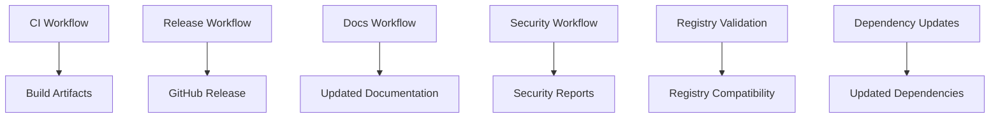

# GitHub Actions Workflows

This directory contains GitHub Actions workflows for automated CI/CD, testing, and maintenance of the Terraform Provider for Technitium DNS Server.

## Workflows Overview

### 🔄 CI (ci.yml)

**Triggers**: Push to main/develop, Pull Requests to main
**Purpose**: Core continuous integration pipeline

**Jobs**:

- **Validate**: Go mod verification, vet, fmt checks
- **Lint**: golangci-lint analysis with comprehensive rules
- **Unit Tests**: Fast unit tests with race detection and coverage
- **Integration Tests**: TestContainers-based integration tests
- **Acceptance Tests**: Full acceptance tests (conditional on label/push)
- **Build**: Multi-platform binary builds (Linux, macOS, Windows)
- **Security**: Gosec and Nancy vulnerability scanning

### 🚀 Release (release.yml)

**Triggers**: Version tags (v*)
**Purpose**: Automated releases with GoReleaser

**Features**:

- Multi-platform binary builds
- GPG signing for security
- GitHub release creation
- Terraform Registry compatible artifacts
- Automated changelog generation

### 📖 Documentation (docs.yml)

**Triggers**: Changes to provider code, examples, or templates
**Purpose**: Auto-generate and maintain provider documentation

**Features**:

- Uses `terraform-plugin-docs` for generation
- Auto-commits updated docs on main branch
- Comments on PRs when docs change
- Validates documentation structure

### 🔧 Dependency Updates (update-deps.yml)

**Triggers**: Weekly schedule (Mondays) + manual dispatch
**Purpose**: Keep dependencies up to date

**Features**:

- Updates all Go dependencies
- Runs tests to verify compatibility
- Creates PRs with dependency updates
- Automated dependency management

### 🏷️ Terraform Registry Validation (terraform-registry.yml)

**Triggers**: Push/PR to main
**Purpose**: Ensure compatibility with Terraform Registry

**Features**:

- Validates provider structure and naming
- Checks required files and directories
- Tests local provider installation
- Ensures registry submission readiness

### 🔒 Security Analysis (codeql.yml)

**Triggers**: Push/PR to main + weekly schedule
**Purpose**: Automated security code analysis

**Features**:

- GitHub CodeQL static analysis
- Go-specific security checks
- Vulnerability detection
- Security advisory integration

## Workflow Dependencies

## Setup Requirements

### For Release Workflow

1. **GPG Key**: Add `GPG_PRIVATE_KEY` and `PASSPHRASE` secrets
2. **GitHub Token**: `GITHUB_TOKEN` (automatically provided)

### For Documentation Workflow

- Requires write permissions to commit docs to main branch

### For Dependency Updates

- Uses `GITHUB_TOKEN` for creating pull requests

## Usage Tips

### Running Acceptance Tests

Acceptance tests are computationally expensive and run:

- Automatically on pushes to main
- On PRs when labeled with `run-acceptance-tests`

### Manual Triggers

Several workflows support manual triggering:

- Dependency updates: Can be run on-demand
- Documentation generation: Triggered by code changes

### Monitoring

- All workflows report status to pull requests
- Failed workflows block merging (branch protection)
- Security scans create alerts in GitHub Security tab

## Best Practices

1. **Branch Protection**: Configure main branch to require:
   - CI workflow success
   - Up-to-date branches
   - Review approval

2. **Labels**: Use `run-acceptance-tests` label for PRs requiring full testing

3. **Secrets Management**: Store sensitive data in GitHub Secrets:
   - GPG keys for signing
   - Any API tokens or credentials

4. **Monitoring**: Regular review of:
   - Dependency update PRs
   - Security scan results
   - Workflow execution times

## Troubleshooting

### Common Issues

**Integration Tests Failing**:

- Check Docker service availability
- Verify TestContainers setup
- Review container resource limits

**Documentation Not Updating**:

- Ensure proper file paths in triggers
- Check write permissions
- Verify tfplugindocs installation

**Release Workflow Failing**:

- Verify GPG key setup
- Check tag format (must be v*)
- Ensure GoReleaser config is valid

### Debug Tips

1. **Verbose Logging**: Most workflows use `-v` flags for detailed output
2. **Artifact Downloads**: Build artifacts available for debugging
3. **Matrix Builds**: Check specific OS/arch combinations for failures
4. **Cache Issues**: Clear cache if dependency resolution fails

## Contributing

When adding new workflows:

1. Follow existing naming conventions
2. Add comprehensive documentation
3. Include appropriate triggers
4. Test with a variety of scenarios
5. Update this README

For workflow modifications, consider:

- Backward compatibility
- Performance impact
- Security implications
- Maintenance overhead
